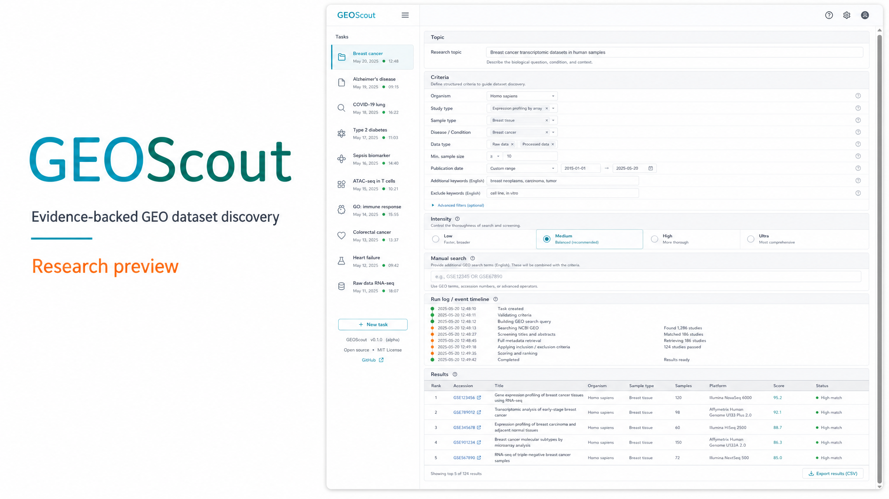

# GEOScout

**发现 GEO 数据集，让筛选依据可复查。**

[English](README.md) · **简体中文**



Local GEO dataset discovery and screening. You bring your own model key. GEOScout expands search terms, talks to NCBI GEO, double-checks with evidence, and exports a reviewable Excel workbook.

本地运行的 GEO 数据集发现与核验工具。用户自备模型 Key，系统扩展检索词、访问 NCBI GEO、用证据做二次检查，并导出可复查的 Excel。

**不承诺穷尽全部 GEO、零漏检，或自动证明某数据集可用于特定科研结论。**

> **当前版本：超级早期公开预览（research preview）。**
> 已验证本地运行、条件解析、样本级硬条件筛选、任务控制和 Excel 导出链路；尚未建立准确率、召回率或系统性科学质量结论。推荐结果必须人工复核。

## 要求

- Python 3.11+
- Node 20+
- 本机网络可访问 `https://eutils.ncbi.nlm.nih.gov` 与 `https://ftp.ncbi.nlm.nih.gov`

## 双击启动（推荐试用）

先装一次依赖：

```bash
cd backend && python -m pip install -e ".[dev]"
cd ../frontend && npm install && npm run build
```

然后双击仓库根目录的 `GEOScout.bat`。会在本机 `127.0.0.1:8000` 同时开 API、后台任务和界面，并尝试打开浏览器。**关掉那个黑窗口即停止。** 不要再另开 worker。

若 8000 已被占用，先关掉旧的 GEOScout / uvicorn / Vite。

已打包的文件夹：`powershell -File scripts/build-launcher.ps1`，产物是 `dist/GEOScout/GEOScout.exe`（旁边会生成 `data\`）。不是单文件安装包。

开发时仍可用三个进程：API + worker + `npm run dev`（界面在 [http://127.0.0.1:5173](http://127.0.0.1:5173)）。Windows 也可用 `powershell -File scripts/dev.ps1`。

首次进入是连接页：填写模型 Key 并测试，或选择仅 NCBI 检索。

API：[http://127.0.0.1:8000/api/health](http://127.0.0.1:8000/api/health)

人工试用请跟 [docs/quickstart.md](docs/quickstart.md)：先手工检索 `GSE1000[Accession]` 确认 NCBI，再带自己的模型 Key 跑小预算课题。

## 无需模型 Key 的路径

设置页可稍后填写模型。启动页也可点 **仅 NCBI 检索进入**。工作台支持 **手工英文检索**：直接输入 GEO DataSets 检索式（会自动附加 `"gse"[ETYP]`），worker 真实访问 NCBI E-utilities，列出唯一 GSE 并导出 Excel。

## 模型 Key

默认只保存在 API 进程内存，不写入 SQLite、日志、Excel 或浏览器 localStorage。重启后未完成任务会进入「等待凭据」，重新填写后可从检查点继续。取消不能退回已发出的模型费用。

NCBI API Key 与模型 Key 分开，均为可选。NCBI 联系邮箱请填你自己的地址。

## Docker Compose

端口只发布到宿主回环地址：

```bash
docker compose up --build
```

- Web: http://127.0.0.1:5173
- API: http://127.0.0.1:8000

## 测试

```bash
cd backend
python -m pytest -m "not network and not llm_live"
python -m pytest -m network   # 真实 NCBI 冒烟，需联网
```

前端：

```bash
cd frontend
npm ci
npm run build
npm test
npm run test:e2e:install   # 首次或浏览器包缺失时
npm run test:e2e
```

发布前请看 [docs/release-checklist.md](docs/release-checklist.md)。未配置模型 Key 时，不要把 mock 结果或连接测试写成真实模型验证。演示模式必须同时设置 `GEOSCOUT_ALLOW_DEMO=true` 与 `GEOSCOUT_DEMO_MODE=true`。真实检索失败不会改用演示数据。

## 文档

- [试用](docs/quickstart.md)
- [架构](docs/architecture.md)
- [GEO / NCBI 访问](docs/geo-access.md)
- [验证范围](docs/validation.md)
- [早期公开预览说明](docs/release-preview.md)
- [安全](SECURITY.md)
- [贡献](CONTRIBUTING.md)

## Author

[Guoming Lin](https://github.com/Guoming-Lynn)

## 许可证

MIT。GEO 数据版权与使用以 NCBI 政策为准；本工具默认不重新分发大型附件。
